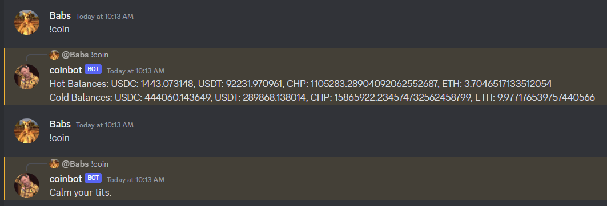

## Overview & Features
- Discord bot that messages user with CoinPoker's hot and cold wallet balances when user writes `!coin`.
- Alchemy API rate limited to 10 requests per second. (8 coins = 8 requests).
- Discord user call limited to once per 10 seconds.

## Setup
- `npm install` to install dependencies
- Fill in proper `.env` variables 
    - Alchemy API key and HTTPS link to fetch on chain data, make sure app is ethereum mainnet. 
    - Discord bot token when creating bot.
- This tutorial is great for setting up bot in discord developer application : https://www.youtube.com/watch?v=KZ3tIGHU314